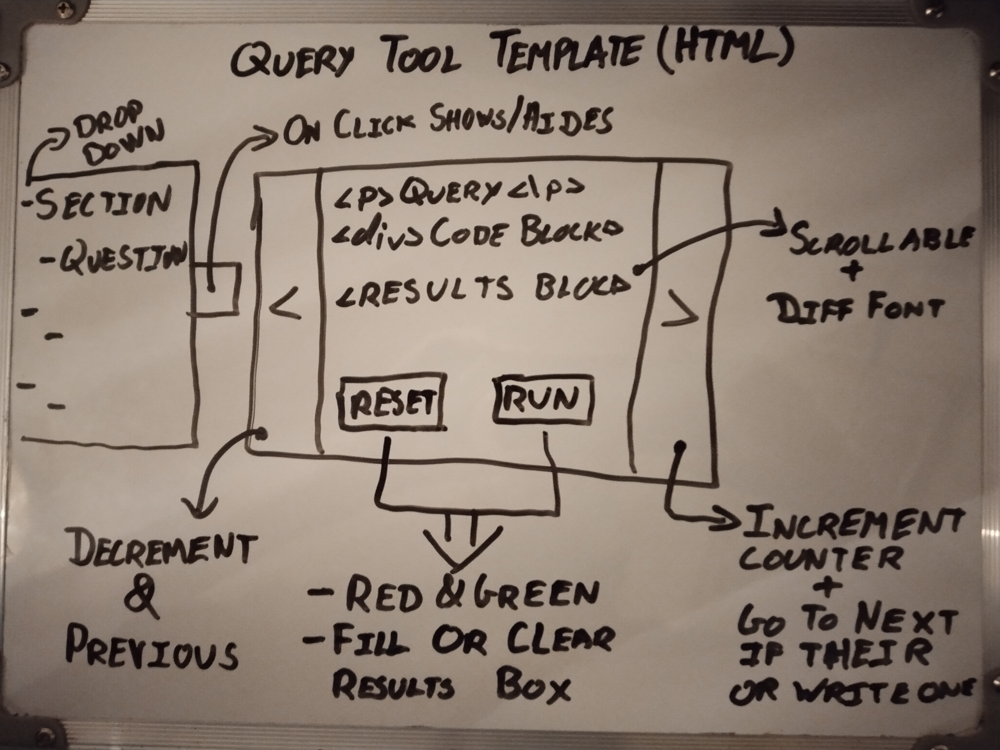

# webdev-ca2
Web app for the supplied database where a javascript app is used to responsively query this database, and pass content + stylings to browser to update the client side.

Storing the required queries to execute in a separate database, with each section being its own auto-incremented table, can serve to tone down on the amount of total content to ideally one HTML page. For instance a bootstrap sidebar / jQuery-UI accordion can be populated with these tables, and the queries to run stored in an object / means to acquire as per the "*javascript/jquery/buttons.html*" page's slide.

Each query and their results can then be sent to a "*TV*" like div broken into one section for the query and another for the results. The TV could also have buttons for switching between the major sections, going to a new section should update the title of the page. Then the "*run all*" button can just channel surf through each query of each section for a set amount of time (~30s results display per query). Would also be nice to link this activity to the sidebar/accordion on the left, where it opens/highlights current position, give the feel of descending through it instead of an instance of class in memory :).

## Notes

- jQuery and AJAX offer simplest means to make the site, particularly as the should be assumed as being with the website. The buttons.html slide show div is simpler and less hassle version of bootstraps-carousel since all decisions can be made via converting this to a class and making the current object a Hashmap. The class implementation will allow for simpler getters-setters, potential converter of array to HTML content (post-ca coding fun).

  - Most queries are done and a few examples can be imported.
  - Will next store these in a text file, add start on the TV HTML.
  - After this look at the slide show.

  

- Should clarify if SQL.js loads the entire database into memory & how to evaluate such things.

  

- Should try out both jQuery's accordion and bootstraps sidebar for navigating content next with 3 example queries from each section (ignore naive CMS for now). Ideally this element can displayed / hidden by a click (template jQuery-animation first div in the buttons.html). However could be a bit too much this time around given the additional software requirements on the menu system side.

  - Populating sidebar from the text based cms is straight forward. However got an "$ not found" error when trying to use from "menu.js". Will revert to vanilla and dom later.
  - Will re-organize to original plan of inserting the appropriate elements later, updating text is fine for now as the TV-Div needs to be created and coded.
  - The index.html will act as a guide, selecting the a query from a section will manage the slide-show.js (instantiating or updating).
  - The CMS should also be its own class simplify getting/setting and serving content... Much the same as the slide-show.js
    - Update the "canary down the cave" version before implementing on the project side.
  
  
  
- No helper functions are really needed since it's just button presses, if time for creating/storing a custom queries can style this using bootstrap modals.

  

- With the boilerplate of the side + nav bar from bootstrap, the starting JS code (slide-show, AJAX, SQL.js & jQuery) can start to look at the HTML.

  - TV div that contains query, results div and buttons.
  - Separate HTML pages for sections and two example queries ( "section1/query1.html, section1/query2.html" etc ).
  - Populating sidebar with the text file containing 2 queries per section.
