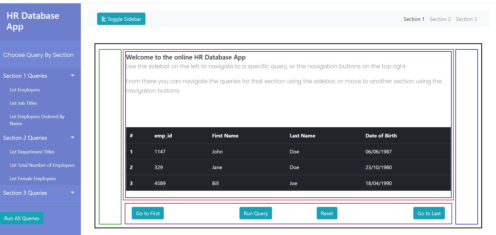

# webdev-ca2
Web app for the supplied database where a javascript app is used to responsively query this database, and pass content to browser.

Storing the required queries to execute in a separate database, with each section being its own auto-incremented table, can serve to tone down on the amount of total content to ideally one HTML page. For instance a bootstrap sidebar / jQuery-UI accordion can be populated with these tables, and the queries to run stored in an object / means to acquire as per the "*javascript/jquery/buttons.html*" page's slide.

Each query and their results can then be sent to a "*TV*" like div broken into one section for the query and another for the results. The TV could also have buttons for switching between the major sections, going to a new section should update the title of the page. Then the "*run all*" button can just channel surf through each query of each section for a set amount of time (~30s results display per query). Would also be nice to link this activity to the sidebar/accordion on the left, where it opens/highlights current position, give the feel of descending through it, instead of an instance of class in memory :).

## Notes

- jQuery and XHTTP offer simplest means to make the site, particularly as the database should be assumed as being with the website. The buttons.html slide show div is simpler and less hassle version of bootstraps-carousel since all decisions can be made via converting this to a class and making the dataset a JSON object. The class implementation will allow for simpler getters-setters, potential converter of array to HTML content (post-ca coding fun).

  - Most queries are done and a few examples can be imported.
  - Will next store these in a text file, add start on the TV HTML.
  - After this look at the slide show.

  

- Should clarify if SQL.js loads the entire database into memory & how to evaluate such things.

  - 30/11/2012: Can do so on sources ex tracking the network for getting the database, or 

    recording memory usage over time for using the response.

  

- Should try out both jQuery's accordion and bootstraps sidebar for navigating content next with 3 example queries from each section (ignore naive CMS for now). Ideally this element can displayed / hidden by a click (template jQuery-animation first div in the buttons.html). However could be a bit too much this time around given the additional software requirements on the menu system side.

  - Populating sidebar from the text based cms is straight forward. However got an "$ not found" error when trying to use from "menu.js" as opposed to some massive script within the landing page / index.html. 
  - Will re-organize to original plan of inserting the appropriate elements later, updating text is fine for now as the TV-Div needs to be created and coded.
  - The index.html will act as a guide, selecting a query from a section will be managed by the slide-show.js.
  - The CMS should also be its own class simplify getting/setting and serving content... Much the same as the slide-show.js
    - Update the "canary down the cave" version before implementing on the project side.
    - 30/11/2021: Not needed at all if data can be served appropriately to a web page.
  
  
  
- No helper functions are really needed since it's just button presses, if time for creating/storing a custom queries can style this using bootstrap modals.

  - 30/11/2021: Where? Page closes and 2 days later revisited, then what :)

  

- With the boilerplate of the side + nav bar from bootstrap, the starting JS code (slide-show, AJAX, SQL.js & jQuery) can start to look at the HTML.

  - Simple enough to setup, some work is needed on the CSS-calc() part though. Simplest is to use current scheme, outter height and widths to percentages.
  
  - Styling tables could cause some issues, could place it another div (i.e results box).
  
  - Need to also update the content for the landing page, but need to properly style relevant query & result boxes.
  
  - Settle on a color stylings for the channel buttons.
  
  - Can now move onto the slide-show.js, which will likely be merged with the cms.js towards the end. But keeping it simple for now.
  
    
  
- Populating the slideshow object:

  - Simple enough, best way forward given how the CMS.js was setup is to use the below format and appropriate getters/setters.
  
  - Navigating sections / pages can be done through slideShow.getSections().keys(), and navigating a section's queries can be done through slideShow.getSection("SectionX").keys().
    
  - From a package point of view, consider renaming the "Section", "Query" to something like Page1 and Item2. Or the user defines their own, and have a slideShow.getRoot("Section1") and slideShow.getChild("Section1", "Query1", "Label | Data").
  
    
  
-  Setting the data attribute as a JSON object is a lot easier then previous suggestions, and removes the need for a two step parsing.
  - Also also means that SlideShow.js can carry a list of keys for the "Sections", and a list of keys for "Pages / Queries". Meaning the SlideShow.js now needs to move in 2 dimensions, mostly setup just need add a setter onto the class methods that will be linked to the buttons (probably an afternoon).
  
  - Adding functionality to TV-Div given instantiation of SlideShow wasn't too bad. Much cleaning is needed on the class documentation, methods and clearer attribute names (For later).
  
    
  
- Styling the TV-Div:

  - Moved the inline stylings to a central external css file + added channel switches + btn colors.

  - Next to style is the Label (header), Query (obvious code block like grey or something) and Results box (copy and paste from previous).

  - Bulk of stylings are done, need to drop the boxes and it then consider next steps. For instance, left / right channels having height 100%.

    

- Next step = Populating the table

  - Populating the table (data & column names are separate object fields):
  
    - Empty the current result block & embed the result in html with class / id values in javascript loop over results
    
  - Read the sql-results header array => html
    - Read each results line array => html
  
      
    
  - The action is straight forward enough:
  
    - Problem is that database is massive and is read into a response, then read into another object.
    - Although the results + db objects are reset to null, memory issues still persist.
    - Fixed by closing the db connection instead of setting to null.
    - Fixed updating the content when navigation buttons are pressed + added function to Reset.
    - Trying to add block on navigating while a query is active:
      - Managed by a global boolean variable that is checked before updating the TV-Div.
      - Maybe better to have an AJAX call to return the database.
      - Queries then use connection, also speeds up the time.
      - Long-term moving to another page, re-creates this db connection.
      - Addressed speed by storing the binary array as variable, that a separate creates a DB + closes connection to.
      - Section1-Query2 breaks page for both versions, check bugs.
      - Current approach now allows for blocking navigation during queries + fixes speed issues.
    - I can now have the index.html read the example 3 queries for 3 sections, then also link out to the sectionYYZ page for all of its queries <= Core website done, and apply touch-ups.
      - Once done look at a loading icon for the resultsBlock, a big white space is not appealing.
      
        
    
- Added the section pages & restricted the Slide-Show.js to only load active section:
  
  - Navigation buttons now move between pages, and channel switches are locked with an alert message.
  - All queries for all section pages are navigable by in the TV-Div.
  - Adding the unknown amount of queries to the sidebar is fine.
  - Managing the JSON object threw up some string errors, so hardcoded for now.
  - New elements in the sidebar after the base 3 are not clickable, despite them being present:
    - When I print the element IDs within the class for the base 3 I can see all elements listed as they should be.
    - Indicating that everything should work normal.
    - When I click the new elements, nothing happens & am not sure how to debug this.
    - $("class / ID") is for static content, $(document).delegate() is for dynamic content :).
    - Given all the hard stuff that was made simple, review the DOM documentation in Javascript.

- Added a loader to indicate that the database is being fetched:
  - Mild tweek is some text to explain what is happening.
  - The text has a margin-top instead of basing it on constantly circulating div.
    

- Settle on the TV-Div stylings while tidying up other elements.
  - Use other queries instead of SQL.js buggey / db.run() for describe.
  - Combine "run_queries.js" with "set-tv-conent.js" into "TV-DB-Utils.js".
    - Consider any other useful functions along the way to make the index.html less busy.
    
  
- Tidy up:

  - Start with the Slide-Show.js:

    - Documentation & class descriptor.

    - Ordering of methods.

      

  - HTML:

    - Comments and drop any commented blocks.

      

  - CSS:

    - Make it "CTRL+F"-able.

      

  - JS on index.html (On completion):

    - What can be off loaded into another module / collection functions (index.html should not be too big).
